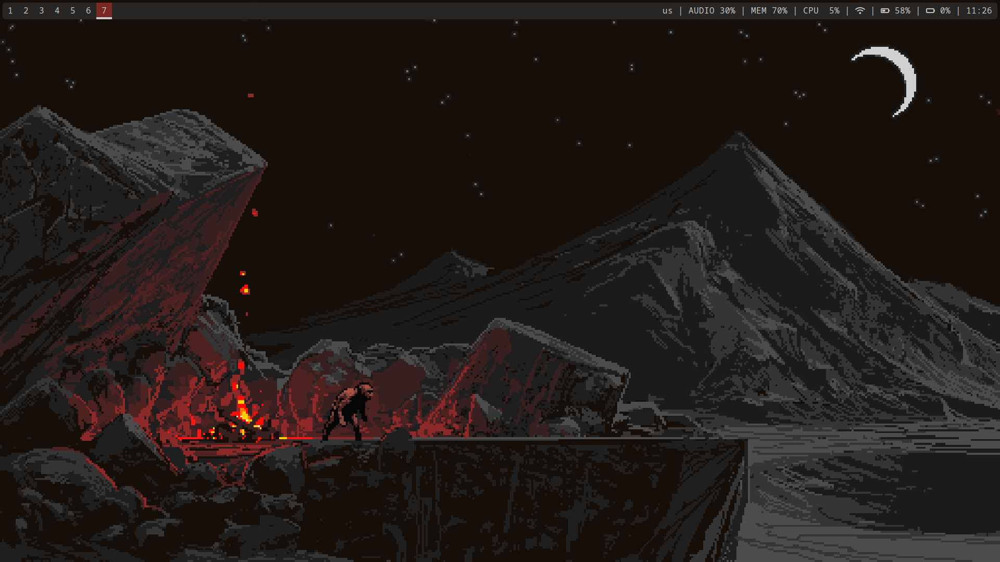

# i3Dotfiles

Put i3 and polybar folder to home/.config/

## Install
- i3-gaps
- polybar
- rofi
- feh
- i3lock
- ffmpeg

## Fonts
- sudo pacman -S xorg-fonts-misc
- yay -S siji-git ttf-unifont
- sudo pacman -S ttf-font-awesome
 
## Make polybar executable
- ls -al .config/polybar/
- sudo chown user:user .config/polybar/config
- ls -al .config/polybar/
- sudo chmod +x .config/polybar/launch.sh

## Add touchpad natural scrolling

you should just need to add the Option line

sudo nvim /usr/share/X11/xorg.conf.d/40-libinput.conf

    Section "InputClass"
    Identifier "libinput touchpad catchall"
    MatchIsTouchpad "on" 
    MatchDevicePath "/dev/input/event*" 
    Driver "libinput"
    Option "NaturalScrolling" "True" 
    EndSection
    
## Brightness
- sudo pacman -S acpilight
- sudo chmod a+rw /sys/class/backlight/intel_backlight/brightness

## i3Lock

From the i3lock-blur folder put the lock.png and lock.sh to the home folder than
- chmod +x lock.sh

## Wallpaper
Put pixelate.png in Pictures folder

